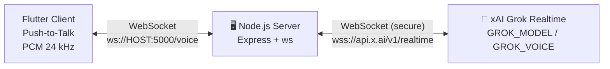
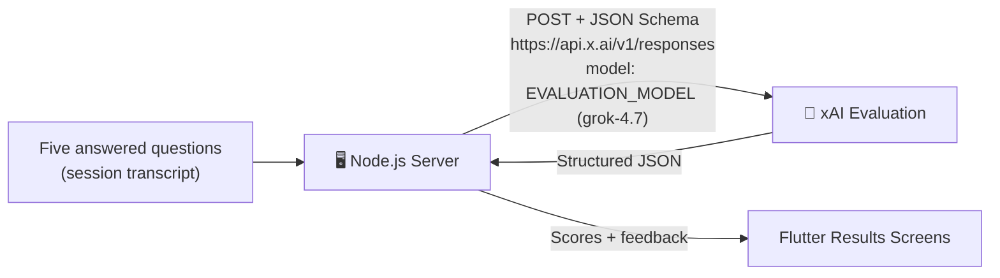
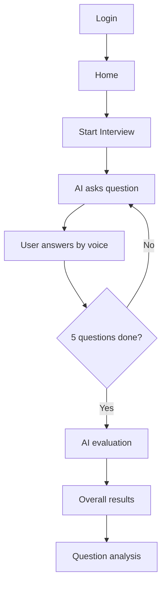

`<div align="center">

# InterviewMe

### AI-powered voice mock interviews with real-time conversation and structured performance evaluation


</div>

---

## Table of Contents

- [ Overview](#-overview)
- [ Tech Stack](#-tech-stack)
- [ Architecture](#️-architecture)
- [ Project Structure](#-project-structure)
- [ Prerequisites & Version Matrix](#-prerequisites--version-matrix)
- [ Installation](#-installation)
- [ Environment & Private Configuration](#-environment--private-configuration)
- [ Android & iOS Platform Setup](#-android--ios-platform-setup)
- [ Running the Project](#️-running-the-project)
- [ Network Routing](#-network-routing)
- [ First-Run Verification](#-first-run-verification)
- [ Interview Flow](#-interview-flow)
- [ AI Evaluation](#-ai-evaluation)
- [ API Reference](#-api-reference)
- [ Troubleshooting](#️-troubleshooting)
- [ FAQ](#-faq)
- [ Development Commands](#-development-commands)
- [ Security](#-security)
- [ Contributing](#-contributing)
- [ Quick Start](#-quick-start)

---

## Overview

**InterviewMe** is a mobile mock-interview platform that lets candidates practice technical interviews out loud. An AI interviewer asks questions by voice, listens to the candidate's spoken answers, and, once the session ends, produces a structured, question-by-question performance evaluation.

| Capability | Description |
|---|---|
|  **Voice-first** | Push-to-talk conversation with a Grok-powered interviewer |
|  **Real-time** | Low-latency audio streamed over WebSockets |
|  **Structured evaluation** | JSON-schema constrained scoring, feedback, and recommendations |
|  **Premium ready** | Subscription paywall support through RevenueCat |
|  **Firebase backed** | Firebase Core on the client, Firebase Admin on the server |

> **Note:** InterviewMe is a two-part system. The **backend must be running** before the mobile app can start an interview.

---

##  Tech Stack

###  Mobile (Flutter, app name `ship_app`)

| Package | Version | Purpose |
|---|---|---|
| `file_picker` | ^13.1.0 | File selection |
| `purchases_flutter` | ^10.13.2 | RevenueCat subscriptions |
| `purchases_ui_flutter` | ^10.13.2 | RevenueCat paywall UI |
| `firebase_core` | ^4.15.0 | Firebase initialization |
| `http` | ^1.6.0 | REST requests |
| `web_socket_channel` | ^3.0.3 | Real-time voice WebSocket |
| `record` | ^7.1.1 | Microphone capture |
| `flutter_soloud` | ^4.1.7 | Low-latency audio playback |
| `cupertino_icons` | ^1.0.8 | iOS-style icons |

**Toolchain:** Dart SDK `^3.12.2` · Android `compileSdk = 36` · Java / Kotlin target `17`

###  Backend (`backend/`)

| Package | Version | Purpose |
|---|---|---|
| `express` | ^5.2.1 | HTTP server |
| `ws` | ^8.22.0 | WebSocket server (`/voice`) |
| `firebase-admin` | ^14.5.0 | Firebase Admin SDK |
| `dotenv` | ^18.0.5 | Environment variables |
| `cors` | ^2.8.6 | Cross-origin requests |
| `bcryptjs` | ^3.0.3 | Password hashing |
| `nodemailer` | ^10.0.13 | Email delivery |

**Entry point:** `server.js` · **Default port:** `5000` · **Module type:** CommonJS

---

##  Architecture

### Real-time voice pipeline



```text
Flutter Client (Push-to-Talk, PCM 24kHz)
        <──────────────>
Node.js WebSocket  (/voice, port 5000)
        <──────────────>
xAI Grok Realtime  (wss://api.x.ai/v1/realtime)
```

The Node.js server relays audio and manages the session. The xAI API key stays on the server and never ships inside the mobile app.

###  Post-interview evaluation pipeline



### Full system view

```text
┌──────────────────────┐        ┌────────────────────────────┐        ┌──────────────────────┐
│    Flutter Client    │  ws    │   Node.js + Express + ws   │  wss   │   xAI Grok Realtime  │
│  record · soloud ·   │◄──────►│   GET /health              │◄──────►│   /v1/realtime       │
│  web_socket_channel  │ :5000  │   WS  /voice               │        └──────────────────────┘
└──────────┬───────────┘        │                            │  https ┌──────────────────────┐
           │                    │                            │───────►│   xAI Responses API  │
           │                    └─────────────┬──────────────┘        │   /v1/responses      │
           │                                  │                       └──────────────────────┘
           ▼                                  ▼
   Firebase (client config)           Firebase Admin SDK
   RevenueCat (premium)               (service account)
```

---

## Project Structure

```text
Ship_App/
│
├── android/                     # Android platform project
├── ios/                         # iOS platform project
├── assets/
│   └── images/
│       └── InterviewMe_logo.png # Required: declared in pubspec.yaml
│
├── lib/
│   ├── config/                  # App and network configuration
│   ├── screens/                 # UI screens
│   ├── services/                # WebSocket, audio, API services
│   ├── widgets/                 # Reusable widgets
│   ├── main.dart
│   └── splash_screen.dart
│
├── backend/
│   ├── src/
│   ├── package.json
│   ├── package-lock.json
│   ├── server.js                # Backend entry point
│   ├── .env.example             # Safe template (committed)
│   ├── .env                     #  private, not committed
│   └── firebase-service-account.json   #  private, not committed
│
├── pubspec.yaml
├── pubspec.lock
├── .gitignore
└── README.md
```

---

##  Prerequisites & Version Matrix

| Tool | Requirement | Notes |
|---|---|---|
| **Git** | Any recent version | |
| **Flutter SDK** | Stable channel that bundles **Dart ≥ 3.12.2** | Run `flutter upgrade` if `pub get` reports an SDK constraint error |
| **Node.js** | **Current LTS** (20 or newer recommended) | Express 5 and the latest Firebase Admin need a modern Node |
| **npm** | Bundled with Node | |
| **JDK** | **17** | Must match `sourceCompatibility`, `targetCompatibility`, and Kotlin `jvmTarget` |
| **Android Studio** | Latest stable | With **Android SDK Platform 36**, Build-Tools, and Command-line Tools |
| **Xcode + CocoaPods** | Only for iOS builds (macOS only) | |
| **Device** | Android Emulator or physical Android device | |
| **xAI API key** | Active key with access to the configured models | |

Verify your toolchain:

```bash
git --version
node --version
npm --version
flutter --version
dart --version
java -version
flutter doctor -v
```

Accept the Android SDK licenses (a very common first-run blocker):

```bash
flutter doctor --android-licenses
```

> **Note:** Do not continue until `flutter doctor` shows no required issues for Flutter and Android toolchain.

### 🪟 Windows-specific requirements

| Requirement | Why | Fix |
|---|---|---|
| **Developer Mode ON** | Flutter plugins use symlinks | Run `start ms-settings:developers` and enable it |
| **Short project path** | Windows 260-character path limit breaks Gradle/CMake builds | Clone to something like `C:\dev\Ship_App` |
| **Script execution** | PowerShell can block `npm`/`flutter` scripts | `Set-ExecutionPolicy -Scope CurrentUser RemoteSigned` |
| **Firewall prompt** | Needed for phones to reach the backend | Click **Allow** for Node.js on private networks |

---

##  Installation

### 1. Clone the repository

```bash
git clone https://github.com/shafaqub/Ship_App.git
cd Ship_App
```

### 2. Install Flutter dependencies`

```bash
flutter pub get
```

### 3. Install backend dependencies

```bash
cd backend
npm ci
cd ..
```

> **Note:** `npm ci` installs the exact versions from `package-lock.json`, which gives every developer an identical backend. If `npm ci` complains that the lockfile is out of sync, use `npm install` instead. Do not install packages one by one.

### 4. (Optional) Generate launcher icons

```bash
dart run flutter_launcher_icons
```

---

## Environment & Private Configuration

Private files are **not included in the repository**. Create or place each file below before running the app.

| # | File | Location | Required for |
|---|---|---|---|
| 1 | `.env` | `backend/.env` | Backend start-up, xAI access |
| 2 | `firebase-service-account.json` | `backend/firebase-service-account.json` | Firebase Admin |
| 3 | `google-services.json` | `android/app/google-services.json` | Android Firebase |
| 4 | `GoogleService-Info.plist` | `ios/Runner/GoogleService-Info.plist` | iOS Firebase |
| 5 | RevenueCat keys | Provided separately | Premium subscriptions |

### Backend environment file: `backend/.env`

Copy the template, then edit it:

```bash
# macOS / Linux / Git Bash
cp backend/.env.example backend/.env
```

```powershell
# PowerShell
Copy-Item backend\.env.example backend\.env
```

Contents:

```env
PORT=5000
XAI_API_KEY=your_xai_api_key_here
GROK_MODEL=grok-voice-latest
EVALUATION_MODEL=grok-4.7
GROK_VOICE=eve
```

| Variable | Default | Required | Description |
|---|---|---|---|
| `PORT` | `5000` | No | Port for HTTP and WebSocket |
| `XAI_API_KEY` | none | **Yes** | Your xAI API key |
| `GROK_MODEL` | `grok-voice-latest` | No | Realtime voice model |
| `EVALUATION_MODEL` | `grok-4.7` | No | Post-interview evaluation model |
| `GROK_VOICE` | `eve` | No | Interviewer voice |

> **Note:** No quotes, no spaces around `=`, no trailing spaces. Restart the backend after every `.env` change. If you change `PORT`, update the app's backend URL too.

### Firebase Admin credentials: `backend/firebase-service-account.json`

1. Open the Firebase Console and select your project.
2. Go to **Project settings → Service accounts**.
3. Click **Generate new private key** and download the JSON.
4. Save it as:

```text
backend/firebase-service-account.json
```

### Flutter Firebase configuration

| Platform | File | Location |
|---|---|---|
| 🤖 Android | `google-services.json` | `android/app/google-services.json` |
| 🍎 iOS | `GoogleService-Info.plist` | `ios/Runner/GoogleService-Info.plist` |

Download both from **Firebase Console → Project settings → Your apps**.

> **Note:** The Android package name registered in Firebase must exactly match `applicationId` in `android/app/build.gradle.kts` (currently `com.example.ship_app`). A mismatch causes Firebase initialization to fail.

### RevenueCat

Premium subscriptions use `purchases_flutter` and `purchases_ui_flutter`. RevenueCat API keys, offerings, and products are managed outside the public repository. Without them, the app still runs but the paywall will not load.

---

## Android & iOS Platform Setup

The microphone and a plain `ws://` connection need platform permissions. Confirm these exist, because missing entries are the most common reason a freshly cloned app "runs but does nothing."

### Android: `android/app/src/main/AndroidManifest.xml`

```xml
<manifest xmlns:android="http://schemas.android.com/apk/res/android">

    <uses-permission android:name="android.permission.INTERNET" />
    <uses-permission android:name="android.permission.RECORD_AUDIO" />

    <application
        android:usesCleartextTraffic="true"
        ... >
```

| Entry | Why |
|---|---|
| `INTERNET` | Network access in release builds |
| `RECORD_AUDIO` | Microphone recording |
| `usesCleartextTraffic="true"` | Android 9+ blocks unencrypted `ws://` and `http://` by default. Needed for local development against `10.0.2.2` or a LAN IP |

> **For production**, host the backend behind HTTPS/WSS (`wss://`) and remove `usesCleartextTraffic`.

###  iOS: `ios/Runner/Info.plist`

```xml
<key>NSMicrophoneUsageDescription</key>
<string>InterviewMe needs the microphone to record your interview answers.</string>
```

Then install pods (macOS only):

```bash
cd ios
pod install
cd ..
```

> **Note:** For local `ws://` development on iOS, App Transport Security may require a development exception. Prefer `wss://` for anything beyond local testing.

### Gradle requirements (`android/app/build.gradle.kts`)

| Setting | Value |
|---|---|
| `compileSdk` | `36` |
| `sourceCompatibility` / `targetCompatibility` | `JavaVersion.VERSION_17` |
| Kotlin `jvmTarget` | `JVM_17` |
| `minSdk` / `targetSdk` | Provided by Flutter |

---

##  Running the Project

InterviewMe needs the **backend** and the **Flutter app** running at the same time.

### Terminal 1: Backend

```bash
cd backend
npm start
```

| Item | Value |
|---|---|
| HTTP | `http://localhost:5000` |
| Voice WebSocket | `ws://localhost:5000/voice` |
| Health check | `http://localhost:5000/health` |

Keep this terminal open.

### Terminal 2: Flutter

```bash
cd Ship_App
flutter devices
flutter run
```

To target a specific device:

```bash
flutter run -d <device_id>
```

---

## Network Routing

>  **Never use `localhost` from the Android Emulator or a physical phone.** Inside those environments, `localhost` is the device itself, not your computer.

| Where the app runs | Backend host | WebSocket URL |
|---|---|---|
|  **Android Emulator** | `10.0.2.2` | `ws://10.0.2.2:5000/voice` |
|  **Physical Android (Wi-Fi)** | Your computer's LAN IP | `ws://<LAN_IP>:5000/voice` |
|  **Physical Android (USB)** | `localhost` via `adb reverse` | `ws://localhost:5000/voice` |
|  **Desktop / same machine** | `localhost` | `ws://localhost:5000/voice` |

```text
Android Emulator ──► 10.0.2.2:5000 ──► Development Computer ──► Node.js Backend ──► xAI Grok
Physical Device  ──► <LAN_IP>:5000 ──► Development Computer ──► Node.js Backend ──► xAI Grok
                     (same Wi-Fi network required)
```

### Find your LAN IP

```bash
# macOS
ipconfig getifaddr en0

# Linux
hostname -I
```

```powershell
# Windows
ipconfig
```

### USB alternative (no LAN IP needed)

With the phone connected by USB and USB debugging enabled:

```bash
adb reverse tcp:5000 tcp:5000
```

The phone can then reach the backend at `localhost:5000`.

### Physical device checklist

1. Phone and computer are on the **same network** (guest Wi-Fi and "client isolation" often block this).
2. The firewall allows inbound connections on port `5000`.
3. The backend address in `lib/config/` uses the LAN IP.
4. The VPN is off on both devices.

---

## First-Run Verification

Run these in order. Each step should pass before moving to the next.

| # | Check | Command / Action | Expected result |
|---|---|---|---|
| 1 | Toolchain | `flutter doctor -v` | No required issues |
| 2 | Backend deps | `cd backend && npm ci` | Completes without errors |
| 3 | Env file | Open `backend/.env` | `XAI_API_KEY` is a real key |
| 4 | Backend starts | `npm start` | Server listens on port `5000` |
| 5 | Health | `curl http://localhost:5000/health` | Successful response |
| 6 | App builds | `flutter run` | App launches to splash/login |
| 7 | Mic permission | Tap the microphone | Permission prompt appears, then recording starts |
| 8 | Voice session | Start an interview | AI speaks the first question |

---

## Interview Flow



The current interview contains **five Front-End Web Development questions**:

| # | Topic |
|---|---|
| 1 | Semantic HTML, accessibility, and SEO |
| 2 | Responsive web design and CSS |
| 3 | JavaScript fundamentals and asynchronous JavaScript |
| 4 | Frontend debugging, REST APIs, and HTTP |
| 5 | React and frontend performance |

### Push-to-talk

```text
Tap Microphone → Record Answer → Stop Recording → Send Audio (PCM 24 kHz)
      → AI Processes Response → Next Question
```

---

## AI Evaluation

After the fifth question, the backend evaluates the candidate's **actual answers** with `EVALUATION_MODEL` and returns structured JSON.

| Category | Included |
|---|---|
| **Overall** | Overall score, summary, recommendations |
| **Skill breakdown** | Technical knowledge, communication, clarity, confidence |
| **Per question** | Individual score and question-specific feedback |
| **Insights** | Strengths and areas for improvement |

Results appear in the **Overall Results** and **Question Analysis** screens.

---

## API Reference

| Type | Endpoint | Description |
|---|---|---|
| `GET` | `/health` | Backend health check |
| `WS` | `/voice` | Real-time voice session between the app and xAI Grok |

| Upstream service | URL | Used for |
|---|---|---|
| xAI Realtime | `wss://api.x.ai/v1/realtime` | Live voice conversation |
| xAI Responses | `https://api.x.ai/v1/responses` | JSON-schema evaluation |

---

## Troubleshooting

### Master checklist

- [ ] `flutter doctor -v` shows no required issues
- [ ] Android SDK licenses accepted
- [ ] Java 17 and Android SDK Platform 36 installed
- [ ] `backend/.env` exists with a valid `XAI_API_KEY`
- [ ] `backend/firebase-service-account.json` is in place
- [ ] `google-services.json` / `GoogleService-Info.plist` are in place
- [ ] `assets/images/InterviewMe_logo.png` exists
- [ ] Backend is running and `/health` responds
- [ ] Emulator uses `10.0.2.2`; physical device uses the LAN IP or `adb reverse`
- [ ] `INTERNET` and `RECORD_AUDIO` permissions are in `AndroidManifest.xml`
- [ ] Microphone permission is granted on the device

### Symptom lookup

| Symptom | Likely cause | Fix |
|---|---|---|
| `Because ship_app requires SDK version ^3.12.2…` | Flutter/Dart too old | `flutter upgrade` |
| `Unable to locate Android SDK` | SDK path not set | `flutter config --android-sdk <path>` |
| `Android license status unknown` | Licenses not accepted | `flutter doctor --android-licenses` |
| `Unsupported class file major version` | Wrong JDK | Use JDK 17, then `flutter config --jdk-dir <path>` |
| `Failed to find Platform SDK with path: platforms;android-36` | SDK 36 missing | Install it in Android Studio SDK Manager |
| Gradle fails with very long path errors (Windows) | 260-char limit | Move the project to a short path like `C:\dev\` |
| `Building with plugins requires symlink support` (Windows) | Developer Mode off | Enable Developer Mode |
| `No Firebase App '[DEFAULT]' has been created` | Firebase config missing or not wired | See [Firebase issues](#-firebase-issues) |
| Mic button does nothing | Permission missing or denied | See [Microphone](#-microphone-does-not-work) |
| `Connection refused` on the app | Backend down, or `localhost` used | Start backend; use `10.0.2.2` or LAN IP |
| `Cleartext HTTP traffic not permitted` | Android blocks `ws://` | Add `usesCleartextTraffic="true"` for dev |
| `EADDRINUSE` | Port 5000 busy | Stop the other process or change `PORT` |
| `401` / `403` from xAI | Bad key or no model access | See [API key validation](#-api-key-validation) |

### Microphone does not work

1. Confirm `RECORD_AUDIO` is in `AndroidManifest.xml` (and `NSMicrophoneUsageDescription` on iOS).
2. Grant the permission: **Settings → Apps → InterviewMe → Permissions → Microphone**.
3. Emulator: open **Extended controls (⋯) → Microphone** and enable **Virtual microphone uses host audio input**.
4. Fully restart the app (not hot reload):

```bash
flutter run
```

### Android build fails

The project requires `compileSdk = 36` and Java / Kotlin target `17`.

```bash
java -version
flutter doctor -v
flutter clean
flutter pub get
flutter run
```

If Gradle still fails, clear its cache and retry:

```bash
cd android
./gradlew clean        # Windows: gradlew.bat clean
cd ..
flutter run
```

### Flutter dependencies fail

```bash
flutter clean
flutter pub get
flutter run
```

If versions still conflict, remove the lockfile cache and re-resolve:

```bash
flutter pub cache repair
flutter pub get
```

### Backend dependencies fail

From inside `backend/`:

**Git Bash / macOS / Linux**

```bash
rm -rf node_modules
npm install
npm start
```

**PowerShell**

```powershell
Remove-Item -Recurse -Force node_modules
npm install
npm start
```

If installs hang or fail behind a corporate proxy, configure npm:

```bash
npm config set proxy http://<proxy>:<port>
npm config set https-proxy http://<proxy>:<port>
```

### 🔌 Backend does not start

```bash
cd backend
npm install
npm start
```

| Symptom | Likely cause | Fix |
|---|---|---|
| Crash on boot | Missing or malformed `.env` | Recreate from `.env.example` |
| Firebase error | Missing service-account file | Place `firebase-service-account.json` in `backend/` |
| `Cannot find module` | Dependencies not installed | `npm install` in `backend/` |
| Syntax errors on start | Node too old | Upgrade to current LTS |

Find and stop whatever is using port 5000:

```bash
# macOS / Linux
lsof -i :5000

# Windows PowerShell
Get-NetTCPConnection -LocalPort 5000 | Select-Object OwningProcess
```

> **Note (macOS):** On recent macOS versions, AirPlay Receiver can occupy port 5000. Either turn it off in **System Settings → General → AirDrop & Handoff**, or set a different `PORT` (and update the app).

### WebSocket drops or will not connect

1. Check the backend: `curl http://localhost:5000/health`.
2. Emulator: `ws://10.0.2.2:5000/voice`. Physical device: `ws://<LAN_IP>:5000/voice` or use `adb reverse`.
3. Confirm the firewall allows port `5000`.
4. If the socket opens and then closes, read the **backend terminal**. Upstream errors (invalid key, wrong model name, no access to `api.x.ai`) show up there.
5. Switching networks, sleeping the phone, or VPNs can close sockets. Start a fresh interview session.
6. Restart the backend after any `.env` change.

### API key validation

1. Confirm `XAI_API_KEY` in `backend/.env` has no quotes, spaces, or hidden characters.
2. Confirm the key is active in your xAI console and can use the models in `GROK_MODEL` and `EVALUATION_MODEL`.
3. A `401` or `403` in the backend logs means an invalid key or missing access.
4. Confirm your network allows outbound HTTPS and WSS to `api.x.ai`.

### Firebase issues

| Symptom | Fix |
|---|---|
| `No Firebase App '[DEFAULT]'` | Confirm `google-services.json` is in `android/app/`, and that Firebase is initialized in `main.dart`. If the app uses the Google Services Gradle plugin, confirm it is applied. If it uses `firebase_options.dart`, confirm that file exists (generate it with `flutterfire configure`). |
| App ID mismatch | Make the Firebase Android package name match `applicationId` |
| Backend `Failed to parse private key` | Re-download the service-account JSON; do not edit it |
| Backend cannot find credentials | Confirm the path `backend/firebase-service-account.json` |

### Evaluation fails or returns nothing

- Confirm `EVALUATION_MODEL` is accessible to your key.
- Check backend logs for the response from `https://api.x.ai/v1/responses`.
- Confirm all five questions were answered before evaluation starts.

---

##  FAQ

**Do I need a real Android phone?**
No. An Android Emulator works. Enable its virtual microphone for voice input.

**Do I need an xAI key to run the app?**
Yes. Voice interviews and evaluations both call xAI through the backend.

**Why does the app run but not connect?**
Almost always the backend URL. Emulators need `10.0.2.2`, phones need your LAN IP.

**Can I run it without Firebase files?**
The backend and app expect them. Request the private configuration files from the project owner.

**Can I use a different port?**
Yes. Change `PORT` in `backend/.env` and update the URL in `lib/config/`.

---

## Development Commands

| Area | Command | Purpose |
|---|---|---|
| Flutter | `flutter pub get` | Install dependencies |
| Flutter | `flutter doctor -v` | Diagnose the toolchain |
| Flutter | `flutter devices` | List connected devices |
| Flutter | `flutter run` | Run the app |
| Flutter | `flutter clean` | Clear build cache |
| Flutter | `flutter analyze` | Static analysis |
| Flutter | `flutter test` | Run tests |
| Flutter | `flutter build apk` | Build an APK |
| Backend | `npm ci` / `npm install` | Install dependencies |
| Backend | `npm start` | Start the server (`node server.js`) |
| Backend | `npm run dev` | Development start (`node server.js`) |
| Git | `git status` | Check working tree |
| Git | `git pull origin main` | Update from main |

---

## Security

> Never commit secrets. Private credentials are provided separately to authorized developers.

Do **not** commit:

```gitignore
backend/.env
backend/firebase-service-account.json
backend/node_modules/
android/app/google-services.json
ios/Runner/GoogleService-Info.plist
```

If a key is ever exposed, rotate it immediately in the xAI console or Firebase Console, and remove it from Git history.

### Before publishing to Google Play

| Item | Current state | Action |
|---|---|---|
| Release signing | Uses the **debug** signing config | Create a release keystore and configure it |
| Application ID | `com.example.ship_app` | Change to your own package name (Play rejects `com.example.*`) |
| Firebase Android app | Registered to the current ID | Re-register after renaming |
| Cleartext traffic | Enabled for development | Remove and use `wss://` over HTTPS |
| Backend hosting | Local machine | Deploy to a server with TLS |

---

## Contributing

1. Fork the repository and create a branch: `git checkout -b feature/your-feature`
2. Run `flutter analyze` and fix any issues
3. Commit with a clear message
4. Push and open a Pull Request describing what changed and how you tested it

---

##  Quick Start

```bash
# 1. Clone
git clone https://github.com/shafaqub/Ship_App.git
cd Ship_App

# 2. Install
flutter pub get
cd backend
npm ci
cp .env.example .env     # PowerShell: Copy-Item .env.example .env
```

Edit `backend/.env` and set `XAI_API_KEY`. Then add the private files:

```text
backend/firebase-service-account.json
android/app/google-services.json
ios/Runner/GoogleService-Info.plist
```

Run:

```bash
# Terminal 1: backend
cd backend
npm start

# Terminal 2: Flutter (from project root)
cd Ship_App
flutter run
```

Emulator WebSocket URL: `ws://10.0.2.2:5000/voice`

---

<div align="center">

** Shipaton 2026 · InterviewMe, AI Mock Interview Application**

Built with Flutter, Node.js, Firebase, and xAI Grok

</div>
